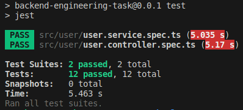
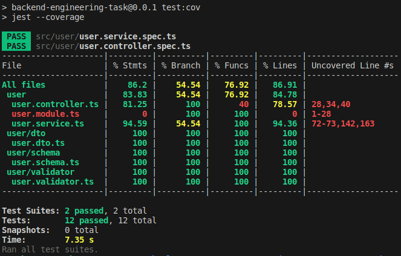
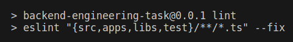
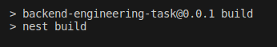

# **BACKEND ENGINEERING TASK**

## Description

The given task is to create a simple REST application from scratch. The application has a code for nodeJS server API communicating with this: [ReqRes](https://reqres.in/)

## Technology Stack

- NestJS Framework
- TypeScript
- MongoDB

## Requirements

For development, you will need the followings and a node global package, `NPM`.

### Prerequisites

- Node.js (lts)
- [TypeScript](https://www.typescriptlang.org/docs/) 3.4 and above
- [NestJS](https://docs.nestjs.com/) Framework
- MongoDB 4.4 and above
- RabbitMQ 3.7 and above

## App Setup

You can configure this app by following the instructions mentioned below:

### Download Zip

Download the zip file in your local directory

### Instal Packages

```bash
$ npm install
```

### Run Project Locally

```bash
# development
$ npm run start

# watch mode
$ npm run start:dev
```

### Automated Unit Tests

Unit tests are written for the provided solution in *./src/user/. Run the following command from the root directory:

```bash
# unit tests
$ npm run test
```


Run the following command to check the test coverage:

```bash
# test coverage
$ npm run test:cov
```



## Documentation

### APIs Working

This REST app consists of:

**1. POST /api/users**

This API is written to store the user on ReqRes. When the user is created, an email is sent and a rabbit event is published. No consumer is added.

**2. GET /api/user/{userId}**

This API is to fetch data from _https://reqres.in/api/users/{userId}_ and returns a user in JSON representation.

**3. GET /api/user/{userId}/avatar**

This is to retrieve image by 'avatar' URL.

On the first request it saves the image as a plain file, stores the avatar hash with userId as a mongodb entry and returns its base64-encoded representation.

On following requests it returns the previously saved file in base64-encoded. representation, retrieved from db.

**4. DELETE /api/user/{userId}/avatar**

It removes the file from the FileSystem storage and the entry from db.

### Published API Documentation

[API Documentation Link](https://documenter.getpostman.com/view/29288262/2sA3Bn4rkD)

### References of Running Solution

This app passes eslint. Run the following command to check:

```bash
# eslint
$ npm run lint
```



This app builds app successfully. Run the following command to check:

```bash
# eslint
$ npm run build
```




[Video Ref. of Running Solution of Tasks](https://www.loom.com/share/4fd122d25d974c8c8a69e5b4f39a985a?sid=a8184f0d-f7bc-407d-ada7-459f209bdce1)

### Error Handling

- The error messages returned by the API are iformative. 
- Handled unexpected errors using try-catch statement where needed.
- Returned the error messages where required.
- Tested error scenarios and unexpected errors.

### Assumptions

- For task # 2 Get Avatar: I have saved the user avatar as a plain file in the uploads directory considering that the avatar link would always have a jpg extension starting with the given userId then a dash(-) then image before the file extension such as: userId-image.jpg.
- Consider a case where 2 users have the same image name then the downloaded file for the other user could be overridden but for this task I have assumed that these downloaded files would always be saved with different unique names in the uploads directory.

### Additional Information

- The _./src/main.ts_ is the starting point of this app.
- Only the required dependencies and devDepndencies are installed in the app.  
- The project builds and can start.
- All the endpoints can be requested from any API tester like [Postman](https://www.postman.com/).
- Requested data is stored in DB and a Rabbit MQ event is emitted.
- This app contains the unit tests for the requested APIs.

### Key Points

- I have made the project structure as flexible as possible, so it can be expanded any time.
- I have created the dto, schema, validator, controller, service, and tests in user directory for the purpose of maintinability, scalability, and flexibility.
- As a bonus, I have added some of the unit tests as well.
